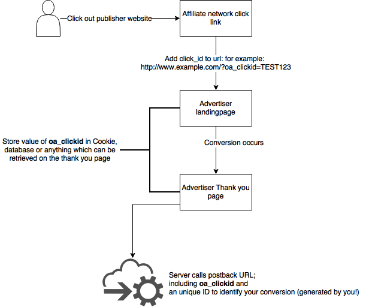

# Postback concept explained

Postbacks / Server2Server pixel / Conversion trackback is a way to track conversions without using third-party cookies. The advertiser's server calls an URL after conversion instead of the user's browser which makes this tracking method more reliable and secure.

**Postback flow**

 1. User clicks tracking-link on publisher's website
 2. OnlineActivity tracking-link redirects user to advertiser's landingpage. An unique click-id is added to the URL.
 3. Advertiser stores the unique click-id in any way (cookie, session, database) 
 4. User converts on landingpage. 
 5. Advertiser stores unique click-id in advertiser's database for further reference.
 6. Adverter calls OnlineActivity's postback URL with the unique click-id. 
 7. OnlineActivity records the conversion and rewards publisher.

